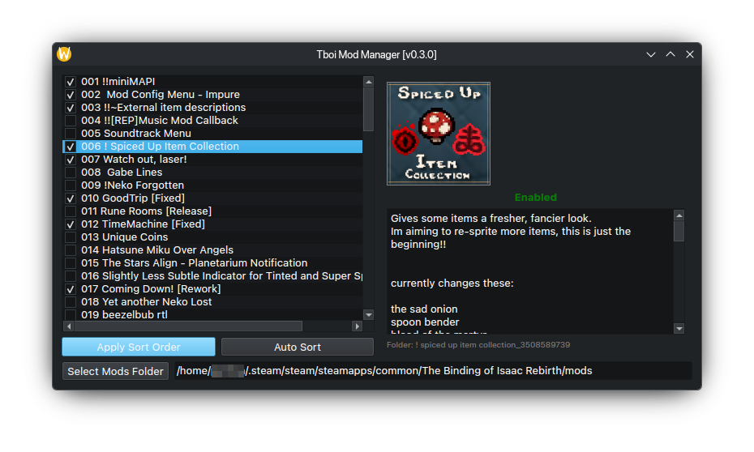
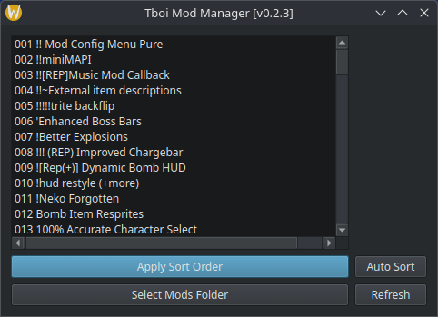
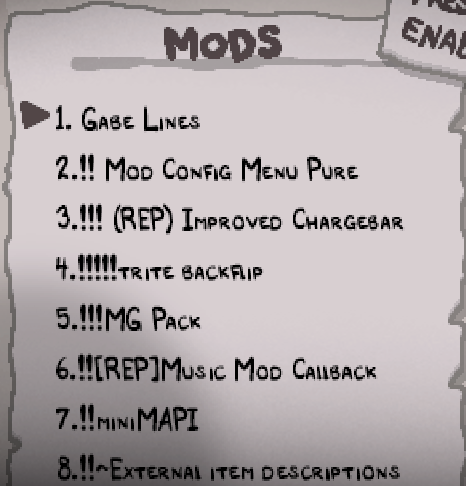
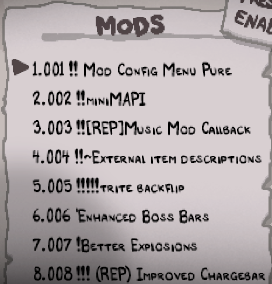

<div align="center">

#  The binding of Isaac - Mod Manager 


---

An experimental way of sorting mods for the game The binding of Isaac: Rebirth (with support for any DLC) 


</div>

## Chapters
1. [How to use](#how-to-use)
2. [Why?](#why)
3. [How it works](#how-it-works)

## 1. HOW TO USE

> [!CAUTION]
> **BEFORE USING THIS! BACKUP YOUR MODS FOLDER, I AM NOT RESPONSIBLE FOR ANY LOSS OF DATA**

> [!IMPORTANT]
> This tool ONLY modifies the "metadata.xml" file, and only 1 field inside, that being "name". My tool does NOTHING else.

Download the executable for your platform from the releases tab (Windows, Linux, MacOS) and run the file.

It will first generate a config file inside the active running directory, this is used to store the path to your mods folder which you HAVE to set if you're on **Windows**, MacOS gets a free pass for being officially unsupported by Edmund and knowing the path is never going to change, and Linux is somewhat more standard, so we guess that the standard directory is also where Isaac is.

If your list is empty, it means the program didn't find any mods or you haven't set the mods folder.

Once your mods are loaded in, simply drag your mods around to order them like so

<div align="center">



</div>

You can now press *Apply Sort Order* to mass-rename all the mods in the defined order.

### Working with the config files

Since the addition of the auto-sort, user defined rules are also accepted, and should be made use of for simpler re-deployment upon steam workshop updates (until I get around to fixing that too). For now, you will find a file in the following directories depending on your platform:

### Windows
```
%LOCALAPPDATA%/IsaacMM/user_rules.yaml
```
### Linux
```
$XDG_CONFIG_HOME/IsaacMM/user_rules.yaml
```
This project respects XDG variables, mainly XDG_DATA_HOME, XDG_CONFIG_HOME & XDG_CACHE_HOME

If **XDG_CONFIG_HOME** is not defined, we fallback to `~/.local/share`)

The cache is saved to **$XDG_CACHE_HOME**, with a fallback to `~/.cache`
### MacOS
```
~/Library/Application Support/IsaacMM/user_rules.yaml
```
Inside this file you can specify which mod IDs should go above or below others. The format is:

```yaml
rules:
   - id: 1234567890
      after: [9876543210, 121212121]

   - id: 3131313131
      after: [9876543210, 121212121]
```
We use the **steam workshop** ID to identify the mods.

## 2. Why?

|                The Problem               |                 The Solution               |
| ---------------------------------------- | ------------------------------------------ |
|  |  | 
| Ugly, Unsorted, A mess, 🤢               | Clean, Organized, Pretty, 😎               |

If you're anything like me and use more than 2 mods that change multiple textures, you are bound to encounter overlap. Most of this is solved by merging or renaming mods to be higher/lower on the load order. But this gets annoying, fast. Introduce, this tool, which makes mass-renaming much more easier by doing it in a visual way. 

## 3. How it works

Tboi sorts mods as follows:

* Symbols: !@#$%^&*()
* Numbers: 1234567890
* Uppercase Letters: ABC
* Lowercase Letters: abc

> [!IMPORTANT]
> When sorting by numbers, the game does not see 100 lower than 2, instead it counts 100 to be the same as 1. With this, we reserve the first 3 characters of a mod name to sorting
>
> * 001 MOD_NAME_1
> * 002 MOD_NAME_2
> * 003 MOD_NAME_3

I don't expect people to have more than 999 mods for this game, but if that proves wrong, the limit can be changed.

## 4. Themes

You can find themes for the manager here: [PetricaT/IsaacMM-themes](https://github.com/PetricaT/IsaacMM-themes)

<details>
  <summary>Dependency graph</summary>

         (mermaid graph)

</details>

## Known issues & TODO

- [x] Add config file versioning & migration
- [x] Add update checker & notification
- [x] Add auto-updater (If possible on all 3 platforms)
- [ ] Add launch game button
- [ ] Add UI locking on active game
- [ ] aarch64 build? (if requested)
