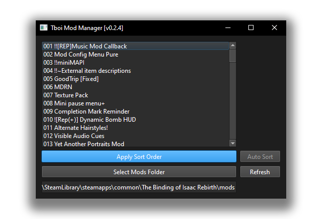
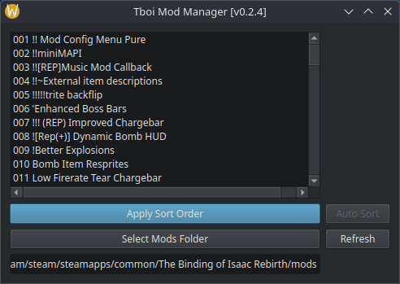

#  The binding of Isaac - Mod Manager 

[](https://github.com/PetricaT/IsaacMM/actions/workflows/python-build.yml)

An experimental way of sorting mods for the game The binding of Isaac: Rebirth (with support for any DLC) 



## Chapters
1. [How to use](#how-to-use)
2. [Why?](#why)
3. [How it works](#how-it-works)
4. [Contributing](#how-to-help)

## 1. HOW TO USE

> [!CAUTION]
> **BEFORE USING THIS! BACKUP YOUR MODS FOLDER, I AM NOT RESPONSIBLE FOR ANY LOSS OF DATA**

> [!IMPORTANT]
> This tool ONLY modifies the "metadata.xml" file, and only 1 field inside, that being "name". My tool does NOTHING else.

Download the executable for your platform from the releases tab (Windows, Linux, MacOS) and run the file.

It will first generate a config file inside the active running directory, this is used to store the path to your mods folder which you HAVE to set if you're on **Windows**, MacOS gets a free pass for being officially unsupported by Edmund and knowing the path is never going to change, and Linux is somewhat more standard, so we guess that the standard directory is also where Isaac is.

If your list is empty, it means the program didn't find any mods or you haven't set the mods folder.

Once your mods are loaded in, simply drag your mods around to order them like so

<div align="center">



</div>

You can now press *Apply Sort Order* to mass-rename all the mods in the defined order.

## 2. Why?

|                The Problem               |                 The Solution               |
| ---------------------------------------- | ------------------------------------------ |
|  |  | 
| Ugly, Unsorted, A mess, 🤢               | Clean, Organized, Pretty, 😎               |

If you're anything like me and use more than 2 mods that change multiple textures, you are bound to encounter overlap. Most of this is solved by merging or renaming mods to be higher/lower on the load order. But this gets annoying, fast. Introduce, this tool, which makes mass-renaming much more easier by doing it in a visual way. 

I am hoping to expand this a bit further, make it more like LOOT with a master-list of predefined rules, but I am not sure if I will ever dedicate that much effort to this project.

## 3. How it works

Tboi sorts mods as follows:

* Symbols: !@#$%^&*()
* Numbers: 1234567890
* Uppercase Letters: ABC
* Lowercase Letters: abc

> [!IMPORTANT]
> When sorting by numbers, the game does not see 100 lower than 2, instead it counts 100 to be the same as 1. With this, we reserve the first 3 characters of a mod name to sorting
>
> * 001 MOD_NAME_1
> * 002 MOD_NAME_2
> * 003 MOD_NAME_3

I don't expect people to have more than 999 mods for this game, but if that proves wrong, the limit can be changed.

## 4. How to help

If you want to aid in the development of this, fork the repo and install the requierments (PyQt6, PySide6, toml) 

``` sh
pip install -r requirements.txt
```

Create a pull request with your changes and I will approve them.

If you know how to make Qt based apps, help would be appreciated in making the GUI code cleaner or better.